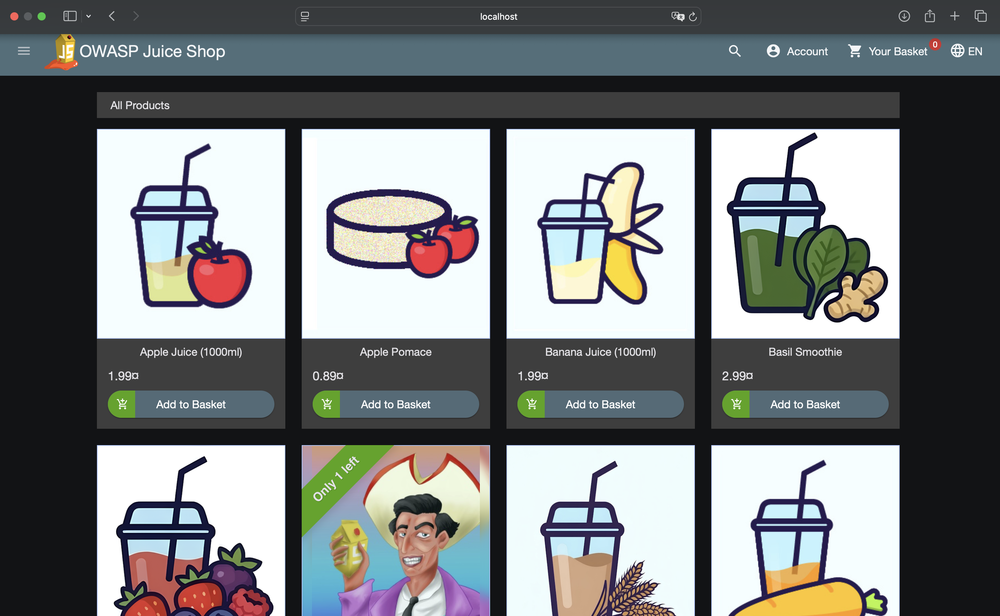
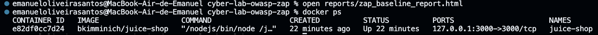
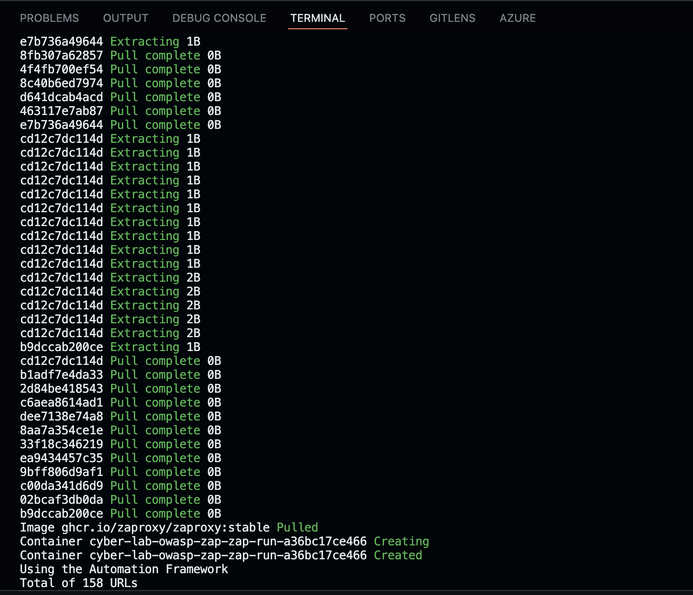
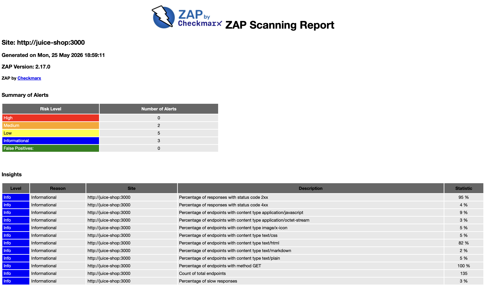
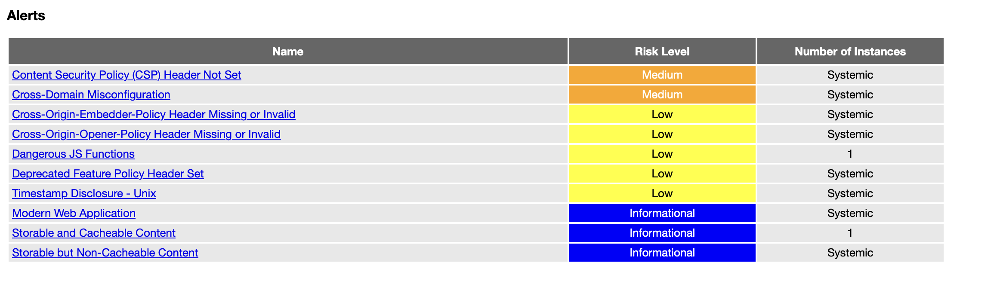

# Laboratório de Segurança Web com OWASP Juice Shop e OWASP ZAP

Este projeto é um laboratório prático de **Cibersegurança** voltado para iniciantes, com foco em **Segurança de Aplicações Web**.

O objetivo foi criar um ambiente local e controlado para executar uma aplicação web propositalmente vulnerável e realizar uma análise automatizada de vulnerabilidades utilizando o **OWASP ZAP**.

A aplicação utilizada como alvo de estudo foi o **OWASP Juice Shop**, uma aplicação vulnerável criada para fins educacionais, treinamentos e estudos sobre segurança web.

---

## Objetivo do projeto

O principal objetivo deste projeto é praticar conceitos fundamentais de cibersegurança, como:

- Segurança de aplicações web;
- Análise dinâmica de vulnerabilidades;
- Uso de ferramentas de DAST;
- Interpretação de relatórios de segurança;
- Documentação técnica de achados;
- Criação de ambiente isolado com Docker.

---

## Ferramentas utilizadas

- **Docker**
- **Docker Compose**
- **OWASP Juice Shop**
- **OWASP ZAP**
- **VS Code**
- **GitHub**

---

## Conceitos praticados

Durante o desenvolvimento deste laboratório, foram praticados conceitos relacionados a:

- AppSec;
- OWASP Top 10;
- DAST — Dynamic Application Security Testing;
- Análise de vulnerabilidades;
- Containers com Docker;
- Relatórios de segurança;
- Boas práticas de documentação.

---

## Estrutura do projeto

```text
cyber-lab-owasp-zap/
├── README.md
├── docker-compose.yml
├── .gitignore
├── reports/
│   └── zap_baseline_report.html
└── evidencias/
    ├── 01-estrutura-projeto.png
    ├── 02-juice-shop-rodando.png
    ├── 03-container-docker.png
    ├── 04-scan-zap-terminal.png
    └── 05-relatorio-zap-html.png
```

---

## Evidências do projeto

As evidências de execução do laboratório estão disponíveis na pasta `evidencias/`.

### Aplicação OWASP Juice Shop em execução



### Container Docker em execução



### Scan executado com OWASP ZAP



### Relatório HTML gerado



### Alertas


---

## Resultados obtidos

Após a execução do scan com o OWASP ZAP, foi gerado um relatório HTML contendo alertas de segurança identificados na aplicação analisada.

Os achados foram avaliados considerando:

- Nome do alerta;
- Nível de risco;
- Evidência apresentada;
- Possível impacto;
- Recomendações de correção.

---

## Exemplos de vulnerabilidades analisadas

| Alerta | Risco | Possível impacto | Recomendação |
|---|---|---|---|
| Cabeçalhos de segurança ausentes | Médio | A aplicação pode ficar mais exposta a ataques como clickjacking ou XSS | Configurar headers como `Content-Security-Policy`, `X-Frame-Options` e `X-Content-Type-Options` |
| Cookie sem flags de segurança | Baixo/Médio | Cookies podem ficar mais expostos em determinados cenários | Utilizar flags como `HttpOnly`, `Secure` e `SameSite` |
| Divulgação de informações | Baixo | Informações técnicas podem auxiliar um atacante no reconhecimento da aplicação | Reduzir exposição de headers, mensagens e detalhes técnicos |

---

## Aprendizados

Com este projeto, foi possível praticar:

- Criação de um laboratório seguro para estudos de cibersegurança;
- Execução de aplicações vulneráveis em ambiente local;
- Uso do Docker para isolamento de ambiente;
- Análise de segurança com OWASP ZAP;
- Geração e interpretação de relatórios de vulnerabilidade;
- Organização de evidências técnicas;
- Documentação de projeto para portfólio profissional.

---

## Possíveis melhorias futuras

Algumas melhorias que podem ser adicionadas ao projeto futuramente:

- Criar uma análise manual de alguns alertas encontrados;
- Classificar os riscos por criticidade;
- Adicionar recomendações mais detalhadas de mitigação;
- Comparar os resultados do Baseline Scan com outros tipos de scan;
- Criar um pequeno relatório técnico em PDF;
- Adicionar um diagrama da arquitetura do laboratório;
- Automatizar a execução do scan com script.

---

## Aviso ético

Este projeto foi desenvolvido exclusivamente para fins educacionais, em ambiente local e controlado.

As ferramentas e técnicas utilizadas neste laboratório não devem ser aplicadas em sistemas de terceiros sem autorização prévia.

O objetivo deste projeto é estudar boas práticas de segurança, análise de vulnerabilidades e documentação técnica de forma ética e responsável.

---

## Autor

**Emanuel Oliveira**

